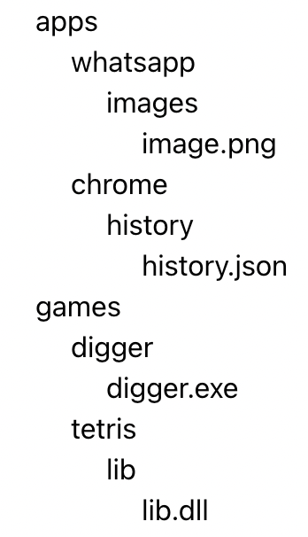

# react-tree
## Task 1
We want to implement a tree component to present our file structure,   
each node on the tree can be a folder or a file.

Implement a React component that receives our data and generates a UI tree.  
Use this file [src/data.json](../src/data.json) which contains the relevant mock data.  
 

