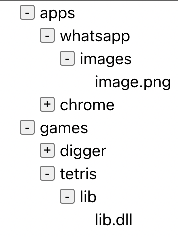

# react-tree
## Task 2
We want to update our tree to be collapsible in a way that each folder on the tree can be collapsed and expended. 
Update your component from the previous task to support it.

 

