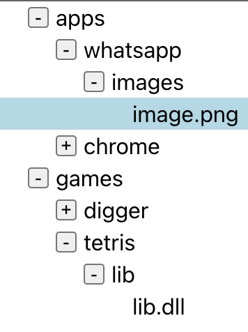

# react-tree
## Task 5 - Bonus 
We want to be able to select an item from the tree when clicking on it.  
However, only one item can be selected at a time.  
The challenge is that we want the entire line to have the selected background.

